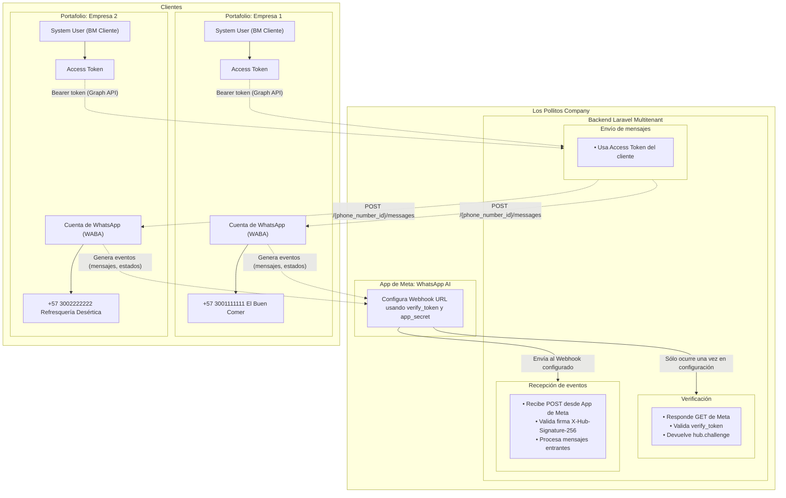

# Laravel WhatsApp Cloud API (Multi Number)

Biblioteca para integrar la API de WhatsApp Cloud en aplicaciones Laravel. Características:

- Soporte para múltiples números (Números de teléfono empresariales)
- Persistencia de contactos, mensajes, conversaciones y errores
- Descarga y carga de medios (imágenes, documentos, audio, video, stickers)
- Manejo opcional de colas para envío y descarga de medios
- Utilidades para marcar mensajes como leídos

---

## Soporte para cuentas empresariales y plantillas

Este paquete ahora soporta la gestión de cuentas empresariales de WhatsApp y plantillas de mensajes:

- **Modelo BusinessAccount**: Representa una cuenta empresarial de WhatsApp, incluyendo campos para nombre, moneda, zona horaria, token de acceso y relación con números y plantillas.
- **Modelo Template**: Representa una plantilla de mensaje de WhatsApp, incluyendo nombre, idioma, categoría y componentes.
- **Factories y migraciones**: Nuevas factories y migraciones para cuentas empresariales y plantillas.
- **Integración en el servicio**: El envío de mensajes y plantillas ahora utiliza los nuevos modelos y relaciones.
- **Tests y stubs**: Cobertura de pruebas y ejemplos actualizados para cuentas empresariales y plantillas.

Consulta los nuevos modelos en `src/Models/BusinessAccount.php` y `src/Models/Template.php`. Las factories y migraciones están en `database/factories/` y `database/migrations/`.

---

## Uso recomendado: Sincronización automática de WABA

La forma recomendada de usar el paquete es crear un registro `BusinessAccount` con el `whatsapp_id` de tu cuenta empresarial de WhatsApp y su token de acceso. El paquete se encargará de recuperar y sincronizar automáticamente toda la información relacionada desde Meta:

- **Números de teléfono**: Todos los números verificados asociados a la WABA se obtienen y almacenan localmente.
- **Plantillas**: Todas las plantillas de mensajes aprobadas para la WABA se recuperan y almacenan.
- **Perfil empresarial**: Nombre, moneda, zona horaria y otros metadatos se mantienen actualizados.

Esto se realiza usando el método `getFromMeta()` en el modelo `BusinessAccount`:

```php
$waba = BusinessAccount::create([
    'whatsapp_id' => 'TU_WABA_ID',
    'access_token' => 'TU_TOKEN_LARGO',
]);

$waba->getFromMeta(); // Sincroniza números, plantillas y perfil empresarial
```

Después de esto, puedes usar los modelos y relaciones del paquete para enviar mensajes, gestionar plantillas e interactuar con todos los recursos de WhatsApp para tu cuenta empresarial.

---

## Conceptos principales



1. **Portafolio comercial**  
   El portafolio comercial es el conjunto de empresas gestionadas en Meta Business. Aquí se crean los usuarios del sistema y se obtienen los tokens de acceso de larga duración para enviar mensajes de WhatsApp. También se vinculan las aplicaciones que usarán la API.

2. **Cuentas de WhatsApp Business (WABA)**  
   Un portafolio comercial puede tener varias cuentas de WhatsApp Business. Cada cuenta representa una empresa o unidad de negocio que gestiona sus propios números y mensajes.

3. **Números de teléfono asociados**  
   Cada cuenta de WhatsApp Business puede tener varios números de teléfono verificados. Estos números se usan para enviar y recibir mensajes a través de la API.

4. **Webhook global**  
   La App define un único webhook global que recibe todos los eventos y mensajes de los diferentes números y cuentas. Este webhook se configura en Meta y es el punto de entrada para procesar mensajes entrantes, notificaciones y errores.

---

## Instalación

```bash
composer require igedeon/laravel-whatsapp
```

Publicar configuración y migraciones (método manual):

```bash
php artisan vendor:publish --provider="LaravelWhatsApp\\WhatsAppServiceProvider" --tag=whatsapp-config
php artisan vendor:publish --provider="LaravelWhatsApp\\WhatsAppServiceProvider" --tag=whatsapp-migrations
php artisan migrate
```

O publicar todo en un solo paso:

```bash
php artisan vendor:publish --provider="LaravelWhatsApp\\WhatsAppServiceProvider" --tag=whatsapp
```

---

## Seguridad del Webhook: Verificación de Firma

El middleware `VerifyMetaSignature` valida la autenticidad de los webhooks recibidos usando el encabezado `X-Hub-Signature-256` y el secreto configurado en `whatsapp.app_secret`. Si la firma es inválida o falta el secreto, la solicitud será rechazada (401) o se lanzará una excepción.

Para pruebas locales, puedes desactivar el middleware usando:

```php
$this->withoutMiddleware(\LaravelWhatsApp\Http\Middleware\VerifyMetaSignature::class);
```

Para pruebas de integración, asegúrate de generar la firma usando:

```php
$signature = hash_hmac('sha256', $rawBody, config('whatsapp.app_secret'));
```

Y enviar el encabezado:

```
X-Hub-Signature-256: sha256=<signature>
```

Si el secreto no está configurado, se lanzará una excepción para evitar procesar webhooks inseguros.

---

## Extender los modelos Contact y ApiPhoneNumber

Puedes extender los modelos `Contact` y `ApiPhoneNumber` para agregar lógica o atributos personalizados. Define la clase del modelo en el archivo de configuración:

```php
// config/whatsapp.php
'contact_model' => \App\Models\CustomContact::class,
'apiphone_model' => \App\Models\CustomApiPhoneNumber::class,
```

Ambos modelos pueden ser sobrescritos para personalizar relaciones, validaciones o métodos. El paquete usará la clase configurada en todos los procesos internos.

Ejemplo de modelo extendido:

```php
namespace App\Models;

use LaravelWhatsApp\Models\Contact;
use LaravelWhatsApp\Models\ApiPhoneNumber;

class CustomContact extends Contact
{
	// Agrega tus métodos o propiedades aquí
}

class CustomApiPhoneNumber extends ApiPhoneNumber
{
	// Agrega tus métodos o propiedades aquí
}
```

Recuerda ejecutar `php artisan config:cache` si usas caché de configuración.

---

### Comando rápido de instalación

El paquete provee un comando para simplificar la instalación:

```bash
php artisan whatsapp:install            # Publica configuración y migraciones
php artisan whatsapp:install --migrate  # Publica y ejecuta migraciones
php artisan whatsapp:install --force    # Fuerza sobrescritura de archivos ya publicados
```

Flags disponibles:

- `--force`: sobrescribe archivos existentes.
- `--no-config`: no publica el archivo de configuración.
- `--no-migrations`: no publica migraciones.
- `--migrate`: ejecuta migraciones inmediatamente.

Ejemplos avanzados:

```bash
php artisan whatsapp:install --no-config --migrate
php artisan whatsapp:install --no-migrations
```

---

## Variables de entorno y configuración (`config/whatsapp.php`)

| Variable | Requerido | Valor por defecto | Descripción |
|----------|-----------|------------------|-------------|
| `WHATSAPP_VERIFY_TOKEN` | Opcional (solo Webhook) | - | Token para validar la verificación del webhook de Meta. Úsalo si expones un endpoint de verificación. |
| `WHATSAPP_APP_SECRET` | Opcional | - | Secreto de la App para validar la firma del webhook. |
| `WHATSAPP_GRAPH_VERSION` | No | `v24.0` | Versión de la Graph API usada para construir URLs de la Cloud API. Actualiza cuando Meta lance nuevas funciones. |
| `WHATSAPP_BASE_URL` | No | `https://graph.facebook.com` | Host base para la Graph API. Cambia solo para pruebas o mocks. |
| `WHATSAPP_DOWNLOAD_DISK` | No | `local` | Disco de Laravel (ver `filesystems.php`) donde se almacenan los archivos descargados. Ejemplo: `public`, `s3`. |
| `WHATSAPP_QUEUE_CONNECTION` | No | `sync` | Conexión de cola (ver `queue.php`). Ejemplo: `redis`, `database`, `sqs`. |
| `WHATSAPP_MEDIA_DOWNLOAD_QUEUE` | No | `default` | Nombre de la cola para el Job `DownloadMedia`. |
| `WHATSAPP_MARK_AS_READ_QUEUE` | No | `default` | Nombre de la cola para el Job `MarkAsRead`. |
| `WHATSAPP_DEFAULT_API_PHONE_NUMBER_ID` | Opcional | `null` | ID del número de teléfono empresarial (`phone_number_id`) usado por defecto al crear mensajes si no se proporciona explícitamente un `ApiPhoneNumber`. |
| `WHATSAPP_DEFAULT_DISPLAY_PHONE_NUMBER` | Opcional | `null` | Número de teléfono de visualización por defecto (ejemplo: +1234567890). |
| `WHATSAPP_EXPIRE_MEDIA_DAYS` | No | `15` | Número de días después de los cuales los medios subidos a WhatsApp expirarán. |

Notas:

1. Para mensajes salientes, necesitas al menos un registro en la tabla `whatsapp_api_phone_numbers` (ver migración) con su `phone_number_id` real obtenido desde el panel de Meta.
2. Si solo hay un registro de `ApiPhoneNumber`, el modelo `WhatsAppMessage` intentará usarlo automáticamente cuando llames a `initMessage()` sin pasar un número.

Ejemplo mínimo de `.env`:

```dotenv
WHATSAPP_APP_SECRET="d33555772181cc8eda34866603d86c77"
WHATSAPP_DOWNLOAD_DISK=public
```

---

## Modelo principal para envío: `WhatsAppMessage`

Flujo básico para enviar un mensaje:

1. Crea (o recupera) el destinatario `Contact` (campo `wa_id` = número sin +, con código de país).
2. Crea o recupera el `ApiPhoneNumber` desde el que envías (si no tienes uno por defecto configurado).
3. Instancia `WhatsAppMessage`, inicialízalo con `initMessage()` pasando el tipo y el contenido.
4. Llama a `send()` en el modelo (delegado al `WhatsAppMessageService`).

Tipos soportados (enum `MessageType`): `text`, `image`, `video`, `audio`, `document`, `sticker`, `location`, `contacts`, `button`, `interactive`, `reaction`, `order`. Algunos requieren estructura específica en `content`.

Nuevo tipo soportado: `template` para mensajes de plantilla aprobados por Meta. Usa un payload con `template => [ name, language[code], components[] ]`.

Estructura genérica de `content` enviado a la API:

```php
[
  // Para texto
  'body' => 'Mensaje de prueba',
  // Para imagen/video/documento/audio (tras subir el medio) usa 'id' del medio
  // 'id' => 'MEDIA_ID'
]
```

El servicio construye automáticamente el payload como:

```json
{
  "messaging_product": "whatsapp",
  "to": "<wa_id>",
  "type": "text|image|...",
  "text|image|video|...": { ... content ... }
}
```

---

## Ejemplo: Enviar mensaje de texto

```php
use LaravelWhatsApp\Models\Contact;
use LaravelWhatsApp\Models\ApiPhoneNumber;
use LaravelWhatsApp\Models\WhatsAppMessage;
use LaravelWhatsApp\Enums\MessageType;

// 1. Obtener o crear contacto
$contact = Contact::firstOrCreate([
	'wa_id' => '5215512345678', // Número destino sin '+'
], [
	'nombre' => 'Juan Perez'
]);

// 2. (Opcional) Obtener número de envío si no hay uno por defecto
$from = ApiPhoneNumber::where('phone_number_id', env('WHATSAPP_DEFAULT_API_PHONE_NUMBER_ID'))->first();

// 3. Crear instancia de mensaje
$message = new WhatsAppMessage();
$message->initMessage(
	type: MessageType::TEXT,
	to: $contact,
	from: $from, // Puede omitirse si hay uno por defecto
	contentProps: [
		'body' => '¡Hola! Este es un mensaje de prueba.'
	]
);

// 4. Enviar
$message->send();
```

## Ejemplo: Enviar mensaje de plantilla

```php
use LaravelWhatsApp\Services\WhatsAppMessageService;
use LaravelWhatsApp\Models\Contact;

$contact = Contact::firstOrCreate(['wa_id' => '5215512345678']);

$service = app(WhatsAppMessageService::class);

$components = [
	[
		'type' => 'body',
		'parameters' => [
			['type' => 'text', 'text' => 'Juan'],
			['type' => 'text', 'text' => 'Pedido #1234'],
		]
	],
	// ...
];

$service->sendTemplateMessage(
	to: $contact,
	name: 'order_confirmation',
	language: ['code' => 'es_MX'],
	components: $components
);
```

---

Para más ejemplos y documentación avanzada, consulta el archivo principal en inglés (`README.md`).
