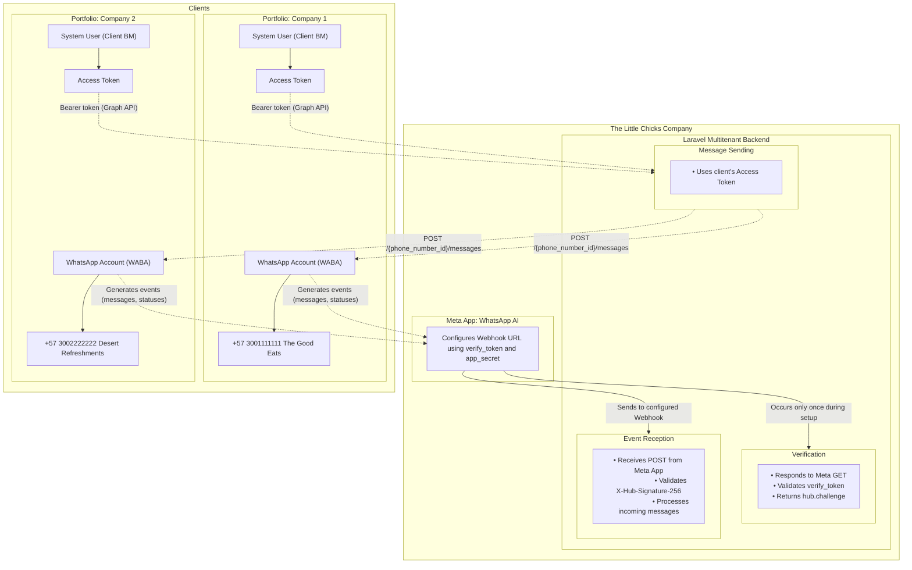

# Laravel WhatsApp Cloud API (Multi App / Multi WABA / Multi Number)

[Versión en Español](./README.es.md)

Library to integrate WhatsApp Cloud API into Laravel applications.

## Features

- Multiple Meta Apps, Business Accounts (WABAs), Access Tokens, and Phone Numbers
- Centralized global webhook with multi-secret signature verification
- Persistence for contacts, messages, templates, media, access tokens, meta apps & errors
- Media upload & download (images, documents, audio, video, stickers)
- Optional queues for media download & mark-as-read jobs
- Configurable immediate mark-as-read behavior
- Interactive configuration command (`php artisan whatsapp:configure`) to validate and persist Meta App, Access Token, WABA subscription & data
- Template message support (Meta-approved templates)

---

## Business Account, Meta App, Access Token & Template Capabilities

- **MetaApp**: Stores `meta_app_id`, `name`, `app_secret`, `verify_token`. Supports multiple apps simultaneously. Webhook GET verification and POST signature validation now search across ALL stored apps.
- **AccessToken**: Stores long-lived token (`access_token`), metadata (`whatsapp_id`, `name`, `expires_at`) and links to a `MetaApp`. Historical tokens can be retained; sending logic uses the latest attached token per Business Account.
- **BusinessAccount**: Represents a WhatsApp Business Account (WABA) including profile data, currency, timezone, template namespace, subscribed apps, phone numbers and templates. Access tokens are a many-to-many relation via `whatsapp_business_tokens`.
- **Template**: Stores approved message templates (name, language, category, components). Associated to Business Accounts; used for outbound template messages.
- **Phone Numbers**: Synced into `whatsapp_api_phone_numbers` with throughput level, webhook configuration, quality rating, etc.

Models live in `src/Models/MetaApp.php`, `AccessToken.php`, `BusinessAccount.php`, `Template.php`, plus related factories and migrations.

---

<!-- Recommended Workflow section merged into Installation -->

## Installation

Recommended end-to-end setup (no manual asset publishing required for basic usage):

1. Install the package:
	```bash
	composer require igedeon/laravel-whatsapp
	```
2. Run migrations (if your application persists WhatsApp data locally):
	```bash
	php artisan migrate
	```
3. Configure your first Meta App / WABA with the interactive wizard:
	```bash
	php artisan whatsapp:configure
	```
	It will prompt for: Access Token, Meta App ID, App Secret, Verify Token, WABA ID and will:
	- Validate token identity (`/me`)
	- Validate the Meta App
	- Check required granular scopes
	- Subscribe the WABA using `subscribe_url` (`APP_URL` + `/whatsapp/webhook`)
	- Persist `MetaApp`, `AccessToken`, `BusinessAccount` and link them via pivot
4. Start sending messages using the models (`Contact`, `ApiPhoneNumber`, `WhatsAppMessage`).
5. Re-run `whatsapp:configure` anytime to rotate tokens or add more Meta Apps.

Notes:
- Manual publishing of config/migrations is no longer required for the core flow.
- Ensure `APP_URL` is correctly set before running the configuration command.

### Optional: Publish or Force (only if you need local customization)

```bash
php artisan whatsapp:install --force      # Overwrite published config/migrations
php artisan whatsapp:install --no-config  # Skip config publish
php artisan whatsapp:install --no-migrations
```

Use these flags only if you want local copies to modify.

---

## Webhook Security: Multi App Signature & Verification

`VerifyMetaSignature` loads all `app_secret` values from `whatsapp_meta_apps` and accepts a request if ANY HMAC matches the `X-Hub-Signature-256` header.

Initial GET verification (`hub.challenge`) succeeds if the provided `hub_verify_token` matches any stored `verify_token`.

Disable middleware for local tests:
```php
$this->withoutMiddleware(\LaravelWhatsApp\Http\Middleware\VerifyMetaSignature::class);
```

Signature generation in tests:
```php
$signature = hash_hmac('sha256', $rawBody, $metaApp->app_secret);
```

Header:
```
X-Hub-Signature-256: sha256=<signature>
```

If none match, request is rejected (401) and logged.

---

## Environment & Config (`config/whatsapp.php`)

| Variable | Required | Default | Description |
|----------|----------|---------|-------------|
| `APP_URL` | Yes | - | Used to build `subscribe_url` (`/whatsapp/webhook`). |
| `WHATSAPP_GRAPH_VERSION` | No | `v24.0` | Graph API version for Cloud API calls. |
| `WHATSAPP_BASE_URL` | No | `https://graph.facebook.com` | Graph API base URL. |
| `WHATSAPP_DOWNLOAD_DISK` | No | `local` | Disk used for downloaded media. |
| `WHATSAPP_QUEUE_CONNECTION` | No | `sync` | Queue connection for jobs. |
| `WHATSAPP_MEDIA_DOWNLOAD_QUEUE` | No | `default` | Queue for `DownloadMedia` job. |
| `WHATSAPP_MARK_AS_READ_QUEUE` | No | `default` | Queue for `MarkAsRead` job. |
| `WHATSAPP_MARK_MESSAGES_AS_READ_IMMEDIATELY` | No | `false` | Dispatch read job immediately on inbound messages. |


Notes:
1. App secrets & verify tokens now reside in DB (`whatsapp_meta_apps`), not env.
2. Access tokens reside in DB (`whatsapp_access_tokens`). Rotate via `whatsapp:configure`.
3. At least one `ApiPhoneNumber` with a real `phone_number_id` is required for outbound messaging.
4. If only one phone number exists, `WhatsAppMessage` may auto-select it when omitted.

Minimal `.env`:
```dotenv
APP_URL="https://example.com"
WHATSAPP_DOWNLOAD_DISK=public
```

---

## Sending Messages (`WhatsAppMessage`)

Basic flow:
1. Create or fetch `Contact` (`wa_id` = number without `+`, with country code).
2. Ensure an `ApiPhoneNumber` exists and is linked to a `BusinessAccount` with at least one `AccessToken`.
3. Instantiate `WhatsAppMessage`, call `initMessage()` with type & content.
4. Call `send()`.

Supported `MessageType` enum values: `text`, `image`, `video`, `audio`, `document`, `sticker`, `location`, `contacts`, `button`, `interactive`, `reaction`, `order`, `template`.

Generic content structure:
```php
[
  'body' => 'Test message',
  // OR for media after upload: 'id' => 'MEDIA_ID'
]
```

Payload automatically sent:
```json
{
  "messaging_product": "whatsapp",
  "to": "<wa_id>",
  "type": "text|image|...",
  "text|image|video|...": { }
}
```

### Example: Send a Text Message
```php
use LaravelWhatsApp\Models\Contact;
use LaravelWhatsApp\Models\ApiPhoneNumber;
use LaravelWhatsApp\Models\WhatsAppMessage;
use LaravelWhatsApp\Enums\MessageType;

$contact = Contact::firstOrCreate([
  'wa_id' => '5215512345678',
], ['name' => 'Juan Perez']);

$from = ApiPhoneNumber::first(); // or locate by phone_number_id

$message = new WhatsAppMessage();
$message->initMessage(
  type: MessageType::TEXT,
  to: $contact,
  from: $from,
  contentProps: ['body' => 'Hello! This is a test message.']
);

$message->send();
```

### Example: Send a Template Message
```php
use LaravelWhatsApp\Services\WhatsAppMessageService;
use LaravelWhatsApp\Models\Contact;

$contact = Contact::firstOrCreate(['wa_id' => '5215512345678']);
$service = app(WhatsAppMessageService::class);

$components = [
  [
    'type' => 'body',
    'parameters' => [
      ['type' => 'text', 'text' => 'Juan'],
      ['type' => 'text', 'text' => 'Order #1234'],
    ]
  ],
  [
    'type' => 'button',
    'sub_type' => 'url',
    'index' => 0,
    'parameters' => [ ['type' => 'text', 'text' => '1234'] ]
  ]
];

$service->sendTemplateMessage(
  to: $contact,
  templateName: 'order_followup',
  languageCode: 'es_CO',
  components: $components
);
```

Expected API structure:
```json
{
  "messaging_product": "whatsapp",
  "to": "5215512345678",
  "type": "template",
  "template": {
    "name": "order_followup",
    "language": { "code": "es_CO" },
    "components": []
  }
}
```

Valid components: `header`, `body`, `footer`, `button`.

---

## Media Upload & Send Image
```php
use LaravelWhatsApp\Models\Contact;
use LaravelWhatsApp\Models\ApiPhoneNumber;
use LaravelWhatsApp\Models\MediaElement;
use LaravelWhatsApp\Models\MessageTypes\Image;

$contact = Contact::firstOrCreate(['wa_id' => '5215512345678']);
$from = ApiPhoneNumber::first();

$media = MediaElement::create([
  'api_phone_number_id' => $from->id,
]);

$media->upload(storage_path('app/example-image.jpg'));

$imageMessage = Image::createFromId(
  to: $contact,
  from: $from,
  mediaId: $media->wa_media_id,
  caption: 'Product photo'
);

$imageMessage->send();
```

---

## Mark Incoming Message as Read
```php
use LaravelWhatsApp\Services\WhatsAppMessageService;
use LaravelWhatsApp\Models\WhatsAppMessage;

$service = app(WhatsAppMessageService::class);
$incoming = WhatsAppMessage::find(123);
$service->markAsRead($incoming);
```

---

## Media Download Job
```php
use LaravelWhatsApp\Jobs\DownloadMedia;
use LaravelWhatsApp\Models\MediaElement;

$media = MediaElement::find(55);
DownloadMedia::dispatch($media); // queue from config
```

---

## Event: `WhatsAppMessageReceived`

Fired on each inbound message. Publish config to override listener.
```php
'listeners' => [
  'whatsapp_message_received' => \LaravelWhatsApp\Listeners\HandleWhatsAppMessageReceived::class,
];
```

Implement your own listener for custom logic (queueable, heavy processing, etc.).

---

## Tests
Run Pest:
```bash
composer test
```

---

## License
MIT
# 
# Laravel WhatsApp Cloud API (Multi Number)

[Versión en Español](./README.es.md)

Library to integrate WhatsApp Cloud API into Laravel applications. Features:

- Support for multiple numbers (Business Phone Numbers)
- Persistence for contacts, messages, conversations, and errors
- Download and upload of media (images, documents, audio, video, stickers)
- Optional queue handling for sending and downloading media
- Utilities to mark messages as read

---

## Business Account and Template Capabilities

This package provides advanced support for managing WhatsApp Business Accounts and Message Templates:

- **BusinessAccount model**: Allows you to represent and manage WhatsApp Business Accounts, including business profile data, currency, timezone, access tokens, and relationships to phone numbers and templates. You can synchronize business account data from Meta, access related phone numbers, and manage templates directly from your Laravel application.

- **Template model**: Lets you define, store, and use WhatsApp message templates, including their name, language, category, subcategory, and components. Templates can be associated with business accounts and used for sending Meta-approved template messages.

- **Phone number management**: Each business account can have multiple associated phone numbers, with support for verification status, quality rating, throughput level, and webhook configuration.

- **Sending messages and templates**: You can send regular and template-based WhatsApp messages using the relationships between contacts, business accounts, phone numbers, and templates. The service layer handles payload construction and API communication.

- **Synchronization and automation**: Business account and template data can be synchronized from Meta using built-in service methods, keeping your local database up to date with the latest account and template information.

- **Extensible relationships**: All models are designed to be extensible, allowing you to override, customize, and add business logic as needed for your application.

Models are located in `src/Models/BusinessAccount.php`, `src/Models/Template.php`, and related files. Factories and migrations are provided for easy setup and testing.

---

## Recommended Usage: Automatic WABA Sync

The recommended approach is to create a `BusinessAccount` record with your WhatsApp Business Account (`whatsapp_id`) and its access token. The package will then automatically retrieve and synchronize all related information from Meta:

- **Phone numbers**: All verified phone numbers associated with the WABA are fetched and stored locally.
- **Templates**: All approved message templates for the WABA are retrieved and stored.
- **Business profile**: Name, currency, timezone, and other metadata are kept up to date.

This is done using the `getFromMeta()` method on the `BusinessAccount` model:

```php
$waba = BusinessAccount::create([
	'whatsapp_id' => 'YOUR_WABA_ID',
	'access_token' => 'YOUR_LONG_LIVED_TOKEN',
]);

$waba->getFromMeta(); // Synchronizes phone numbers, templates, and profile info
```

After this, you can use the package's models and relationships to send messages, manage templates, and interact with all WhatsApp resources for your business account.

---

---

## Core concepts



1. **Business Portfolio**  
	The Business Portfolio is the set of companies managed in Meta Business. Here, system users are created and long-lived access tokens are obtained to send WhatsApp messages. Apps that will use the API are also linked in the portfolio.

2. **WhatsApp Business Accounts (WABA)**  
	A Business Portfolio can have multiple WhatsApp Business Accounts. Each account represents a company or business unit that manages its own numbers and messages.

3. **Associated Phone Numbers**  
	Each WhatsApp Business Account can have several verified phone numbers. These numbers are used to send and receive messages through the API.

4. **Global Webhook**  
	The App defines a single global webhook that receives all events and messages from different numbers and accounts. This webhook is configured in Meta and acts as the entry point to process incoming messages, notifications, and errors.

## Installation

```bash
composer require igedeon/laravel-whatsapp
```

Publish configuration and migrations (manual method):

```bash
php artisan vendor:publish --provider="LaravelWhatsApp\\WhatsAppServiceProvider" --tag=whatsapp-config
php artisan vendor:publish --provider="LaravelWhatsApp\\WhatsAppServiceProvider" --tag=whatsapp-migrations
php artisan migrate
```

Or publish everything in one step:

```bash
php artisan vendor:publish --provider="LaravelWhatsApp\\WhatsAppServiceProvider" --tag=whatsapp
```

---

## Webhook Security: Signature Verification

The `VerifyMetaSignature` middleware validates the authenticity of received webhooks using the `X-Hub-Signature-256` header and the secret configured in `whatsapp.app_secret`. If the signature is invalid or the secret is missing, the request will be rejected (401) or an exception will be thrown.

For local testing, you can disable the middleware using:

```php
$this->withoutMiddleware(\LaravelWhatsApp\Http\Middleware\VerifyMetaSignature::class);
```


For integration tests, make sure to generate the signature using:

```php
$signature = hash_hmac('sha256', $rawBody, config('whatsapp.app_secret'));
```

And send the header:

```
X-Hub-Signature-256: sha256=<signature>
```

If the secret is not configured, an exception will be thrown to prevent processing insecure webhooks.

---

## Extending the Contact and ApiPhoneNumber Models

You can extend the `Contact` and `ApiPhoneNumber` models to add custom logic or attributes. Set the model class in the config file:

```php
// config/whatsapp.php
'contact_model' => \App\Models\CustomContact::class,
'apiphone_model' => \App\Models\CustomApiPhoneNumber::class,
```

Both models can be overridden to customize relationships, validations, or methods. The package will use the configured class in all internal processes.

Example of an extended model:

```php
namespace App\Models;

use LaravelWhatsApp\Models\Contact;
use LaravelWhatsApp\Models\ApiPhoneNumber;

class CustomContact extends Contact
{
	// Add your methods or properties here
}

class CustomApiPhoneNumber extends ApiPhoneNumber
{
	// Add your methods or properties here
}
```

Remember to run `php artisan config:cache` if you use config caching.

---

### Quick Install Command

The package provides a command to simplify installation:


```bash
php artisan whatsapp:install            # Publishes config and migrations
php artisan whatsapp:install --migrate  # Publishes and runs migrations
php artisan whatsapp:install --force    # Forces overwrite of already published files
```

Available flags:

- `--force`: overwrites existing files.
- `--no-config`: does not publish the config file.
- `--no-migrations`: does not publish migrations.
- `--migrate`: runs migrations immediately.

Advanced examples:

```bash
php artisan whatsapp:install --no-config --migrate
php artisan whatsapp:install --no-migrations
```

---

## Environment Variables and Configuration (`config/whatsapp.php`)

| Variable | Required | Default | Description |
|----------|----------|---------|-------------|
| `WHATSAPP_VERIFY_TOKEN` | Optional (Webhook only) | - | Token to validate Meta's webhook verification. Use if you expose a verification endpoint. |
| `WHATSAPP_APP_SECRET` | Optional | - | App Secret for webhook signature validation. |
| `WHATSAPP_GRAPH_VERSION` | No | `v24.0` | Graph API version used to build Cloud API URLs. Update when Meta releases new features. |
| `WHATSAPP_BASE_URL` | No | `https://graph.facebook.com` | Base host for Graph API. Change only for testing or mocks. |
| `WHATSAPP_DOWNLOAD_DISK` | No | `local` | Laravel disk (see `filesystems.php`) where downloaded files are stored. E.g., `public`, `s3`. |
| `WHATSAPP_QUEUE_CONNECTION` | No | `sync` | Queue connection (see `queue.php`). E.g., `redis`, `database`, `sqs`. |
| `WHATSAPP_MEDIA_DOWNLOAD_QUEUE` | No | `default` | Name of the queue for the `DownloadMedia` Job. |
| `WHATSAPP_MARK_AS_READ_QUEUE` | No | `default` | Name of the queue for the `MarkAsRead` Job. |
| `WHATSAPP_EXPIRE_MEDIA_DAYS` | No | `15` | Number of days after which uploaded media is considered expired. |

Notes:

1. For outgoing messages, you need at least one record in the `whatsapp_api_phone_numbers` table (see migration) with its real `phone_number_id` obtained from the Meta panel.
2. If there is only one `ApiPhoneNumber` record, the `WhatsAppMessage` model will try to use it automatically when you call `initMessage()` without passing a number.

Minimal `.env` example:

```dotenv
WHATSAPP_APP_SECRET="d33555772181cc8eda34866603d86c77"
WHATSAPP_DOWNLOAD_DISK=public
```

---

## Main Model for Sending: `WhatsAppMessage`

Basic flow to send a message:

1. Create (or retrieve) the recipient `Contact` (`wa_id` field = number without +, with country code).
2. Create or retrieve the `ApiPhoneNumber` you send from (if you don't have a default configured).
3. Instantiate `WhatsAppMessage`, initialize it with `initMessage()` passing type and content.
4. Call `send()` on the model (delegates to `WhatsAppMessageService`).

Supported types (enum `MessageType`): `text`, `image`, `video`, `audio`, `document`, `sticker`, `location`, `contacts`, `button`, `interactive`, `reaction`, `order`. Some require specific structure in `content`.

New supported type: `template` for Meta-approved template messages. Use a payload with `template => [ name, language[code], components[] ]`.

Generic structure of `content` sent to the API:

```php
[
  // For text
  'body' => 'Test message',
  // For image/video/document/audio (after uploading media) use 'id' of the media
  // 'id' => 'MEDIA_ID'
]
```

The service automatically builds the payload as:

```json
{
  "messaging_product": "whatsapp",
  "to": "<wa_id>",
  "type": "text|image|...",
  "text|image|video|...": { ... content ... }
}
```

---

## Example: Send a Text Message

```php
use LaravelWhatsApp\Models\Contact;
use LaravelWhatsApp\Models\ApiPhoneNumber;
use LaravelWhatsApp\Models\WhatsAppMessage;
use LaravelWhatsApp\Enums\MessageType;

// 1. Get or create contact
$contact = Contact::firstOrCreate([
	'wa_id' => '5215512345678', // Destination number without '+'
], [
	'name' => 'Juan Perez'
]);

// 2. (Optional) Get sending number if no default
$from = ApiPhoneNumber::where('phone_number_id', env('WHATSAPP_DEFAULT_API_PHONE_NUMBER_ID'))->first();

// 3. Create message instance
$message = new WhatsAppMessage();
$message->initMessage(
	type: MessageType::TEXT,
	to: $contact,
	from: $from, // Can be omitted if default is configured
	contentProps: [
		'body' => 'Hello! This is a test message.'
	]
);

// 4. Send
$message->send();
```

## Example: Send a Template Message

```php
use LaravelWhatsApp\Services\WhatsAppMessageService;
use LaravelWhatsApp\Models\Contact;

$contact = Contact::firstOrCreate(['wa_id' => '5215512345678']);

$service = app(WhatsAppMessageService::class);

$components = [
	[
		'type' => 'body',
		'parameters' => [
			['type' => 'text', 'text' => 'Juan'],
			['type' => 'text', 'text' => 'Order #1234'],
		]
	],
	[
		'type' => 'button',
		'sub_type' => 'url',
		'index' => 0,
		'parameters' => [
			['type' => 'text', 'text' => '1234'] // token for dynamic URL
		]
	]
];

$service->sendTemplateMessage(
	to: $contact,
	templateName: 'order_followup',
	languageCode: 'es_CO',
	components: $components
);
```

Expected structure sent to the Cloud API:

```json
{
	"messaging_product": "whatsapp",
	"to": "5215512345678",
	"type": "template",
	"template": {
		"name": "order_followup",
		"language": { "code": "es_CO" },
		"components": [
			{ "type": "body", "parameters": [ {"type":"text","text":"Juan"}, {"type":"text","text":"Order #1234"} ] },
			{ "type": "button", "sub_type": "url", "index": 0, "parameters": [ {"type":"text","text":"1234"} ] }
		]
	}
}
```

Valid components: `header`, `body`, `footer`, `button`. See official documentation for advanced parameters (e.g., images in header, quick_reply buttons, etc.).

### Response and Storage

After sending, `wa_message_id` is saved in the corresponding column and the record is persisted in `whatsapp_messages`.

---

## Example: Upload Media and Send an Image

To send an image, first upload it using a `MediaElement`, then use the `media_id` to create the message:

```php
use LaravelWhatsApp\Models\Contact;
use LaravelWhatsApp\Models\ApiPhoneNumber;
use LaravelWhatsApp\Models\MediaElement;
use LaravelWhatsApp\Models\MessageTypes\Image;

$contact = Contact::firstOrCreate(['wa_id' => '5215512345678']);
$from = ApiPhoneNumber::where('phone_number_id', env('WHATSAPP_DEFAULT_API_PHONE_NUMBER_ID'))->first();

// Create media element and upload file
$media = MediaElement::create([
   'api_phone_number_id' => $from->id,
]);

$uploadResponse = $media->upload(storage_path('app/example-image.jpg'));

// Create and send image message using the media ID
$imageMessage = Image::createFromId(
	to: $contact,
	from: $from, 
	mediaId: $media->wa_media_id,
	caption: 'Product photo' // Optional
);

$imageMessage->send();
```

---

## Mark an Incoming Message as Read

```php
use LaravelWhatsApp\Services\WhatsAppMessageService;
use LaravelWhatsApp\Models\WhatsAppMessage;

$service = app(WhatsAppMessageService::class);
$incoming = WhatsAppMessage::find(123); // Previously stored message with direction INCOMING
$service->markAsRead($incoming);
```

---

## Media Download

When an incoming message contains media, a record is created in `whatsapp_media_elements` and the `DownloadMedia` Job can be executed.

```php
use igedeon\LaravelWhatsApp\Jobs\DownloadMedia;
use LaravelWhatsApp\Models\MediaElement;

$media = MediaElement::find(55);
DownloadMedia::dispatch($media); // Uses queue configured in WHATSAPP_MEDIA_DOWNLOAD_QUEUE
```

The download uses the disk configured in `WHATSAPP_DOWNLOAD_DISK` and saves the file with a unique name.

---

## Event: Message Reception (`WhatsAppMessageReceived`)

The package fires an event every time a message is received via webhook:

```php
LaravelWhatsApp\\Events\\WhatsAppMessageReceived
```

Event properties:

- `$message` (`WhatsAppMessage`): The message record.
- `$media` (`MediaElement|null`): Associated media if applicable and already downloaded.
- `$mediaDownloaded` (`bool`): `true` if the event was fired after media download; `false` if the message had no media.

Flow:
1. Incoming message WITHOUT media: event is fired immediately after persisting the message.
2. Incoming message WITH media: `DownloadMedia` is queued. Event is fired ONLY after download completes.

### Default Listener

The package includes a reference listener:

```php
LaravelWhatsApp\\Listeners\\HandleWhatsAppMessageReceived
```

This listener only does `Log::info(...)`. You can replace it by publishing the package config.

Publish config if you haven't already:

```bash
php artisan vendor:publish --provider="LaravelWhatsApp\\WhatsAppServiceProvider" --tag=config
```

In `config/whatsapp.php` you'll find:

```php
'listeners' => [
	'whatsapp_message_received' => \\LaravelWhatsApp\\Listeners\\HandleWhatsAppMessageReceived::class,
],
```

### Use Your Own Listener

Create your class:

```php
namespace App\\Listeners;

use LaravelWhatsApp\\Events\\WhatsAppMessageReceived;

class MyListener
{
	public function handle(WhatsAppMessageReceived $event): void
	{
		if ($event->mediaDownloaded) {
			// Process already downloaded media
		} else {
			// Process message without media
		}
	}
}
```

Edit `config/whatsapp.php`:

```php
'listeners' => [
	'whatsapp_message_received' => App\\Listeners\\MyListener::class,
],
```

### Listener in Queue

```php
use Illuminate\\Contracts\\Queue\\ShouldQueue;
use Illuminate\\Queue\\InteractsWithQueue;

class MyListener implements ShouldQueue
{
	use InteractsWithQueue;

	public function handle(WhatsAppMessageReceived $event): void
	{
		// Heavy task here
	}
}
```

Make sure to configure `QUEUE_CONNECTION` appropriately.

### Multiple Listeners

You can manually register multiple listeners (if you want separate logic) in your `AppServiceProvider`:

```php
use Illuminate\\Support\\Facades\\Event;
use LaravelWhatsApp\\Events\\WhatsAppMessageReceived;

Event::listen(WhatsAppMessageReceived::class, [
	App\\Listeners\\MyListener::class,
	App\\Listeners\\OtherListener::class,
]);
```

---

## Tests

Add tests in `tests/` and run Pest:

```bash
composer test
```

---

## License

MIT

