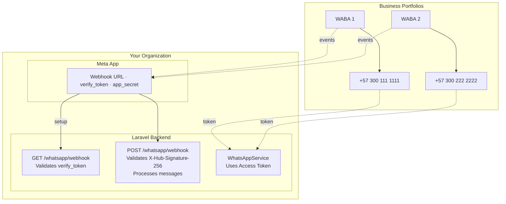

[](https://github.com/IGedeon/laravel-whatsapp/actions/workflows/test.yml)
[](https://github.com/IGedeon/laravel-whatsapp/actions/workflows/lint.yml)
[](https://packagist.org/packages/igedeon/laravel-whatsapp)
[](https://packagist.org/packages/igedeon/laravel-whatsapp)
[](https://packagist.org/packages/igedeon/laravel-whatsapp)
[](https://packagist.org/packages/igedeon/laravel-whatsapp)

# Laravel WhatsApp Cloud API

[Versión en Español](./README.es.md)

Laravel package to integrate Meta's WhatsApp Cloud API with support for multiple Meta Apps, Business Accounts (WABAs), Access Tokens, and Phone Numbers.

## Requirements

- PHP 8.2+
- Laravel 12 or 13

## Features

- Multiple Meta Apps, WABAs, Access Tokens, and Phone Numbers
- Centralized webhook with multi-secret HMAC-SHA256 signature verification
- Full persistence: contacts, messages, templates, media, tokens, errors
- Business-Scoped User ID (BSUID) support — handles users who enable the WhatsApp username feature
- Media upload & download (images, documents, audio, video, stickers)
- Optional queues for media download and mark-as-read
- Template message support (Meta-approved templates)
- Interactive `whatsapp:configure` command for guided setup
- [Laravel Boost](https://laravel.com/docs/boost) AI guidelines included

---

## Installation

```bash
composer require igedeon/laravel-whatsapp
```

Run migrations and configure your first Meta App / WABA:

```bash
php artisan whatsapp:install --migrate
php artisan whatsapp:configure
```

`whatsapp:configure` prompts for Access Token, Meta App ID, App Secret, Verify Token and WABA ID. It validates credentials, subscribes the webhook, and persists all records in the database.

### Optional: publish assets for local customization

```bash
php artisan vendor:publish --tag=whatsapp-config
php artisan vendor:publish --tag=whatsapp-migrations
php artisan vendor:publish --tag=whatsapp-ai-guidelines  # Laravel Boost guidelines
```

---

## Architecture

All credentials (app secrets, access tokens, WABA IDs) are stored in the **database**, not in `.env`.

```
MetaApp ──── AccessToken ──────── BusinessAccount
                                       │
                                  ApiPhoneNumber
                                       │
                    ┌──────────────────┤
                    │                  │
                  Contact          WhatsAppMessage ── MediaElement
                                                   └── WhatsAppMessageError
```

| Model | Table | Purpose |
|---|---|---|
| `MetaApp` | `whatsapp_meta_apps` | Meta App credentials |
| `AccessToken` | `whatsapp_access_tokens` | OAuth tokens (many-to-many with WABA) |
| `BusinessAccount` | `whatsapp_business_accounts` | WABA data |
| `ApiPhoneNumber` | `whatsapp_api_phone_numbers` | Phone numbers |
| `Contact` | `whatsapp_contacts` | WhatsApp users (identified by `user_id` BSUID or `wa_id` phone) |
| `WhatsAppMessage` | `whatsapp_messages` | Sent and received messages |
| `MediaElement` | `whatsapp_media_elements` | Media files |
| `Template` | `whatsapp_templates` | Message templates |

---

## Contacts & Business-Scoped User IDs (BSUID)

From **March 31, 2026**, Meta includes a `user_id` (BSUID) in all webhook payloads. When a WhatsApp user enables the username feature, their phone number (`wa_id`) may be absent from webhooks.

The package handles this automatically:
- Contacts are identified by `user_id` (BSUID) when available; falls back to `wa_id` (phone)
- Outgoing messages use `to` (phone) when available; falls back to `recipient` (BSUID)
- `username` is stored on the contact when present

Contact fields:

| Field | Description |
|---|---|
| `wa_id` | Phone number (nullable — may be absent if user enabled username) |
| `user_id` | BSUID, e.g. `CO.13491208655302741918` (always present from 2026-03-31) |
| `username` | WhatsApp username e.g. `@johndoe` (optional) |

---

## Sending Messages

```php
use LaravelWhatsApp\Models\Contact;
use LaravelWhatsApp\Models\ApiPhoneNumber;
use LaravelWhatsApp\Models\MessageTypes\Text;
use LaravelWhatsApp\Models\MessageTypes\Image;

$from = ApiPhoneNumber::first();

// By phone number
$contact = Contact::firstOrCreate(
    ['api_phone_id' => $from->id, 'wa_id' => '5215512345678'],
    ['name' => 'Juan Perez']
);

// By BSUID (when phone is unavailable)
$contact = Contact::firstOrCreate(
    ['api_phone_id' => $from->id, 'user_id' => 'CO.13491208655302741918'],
    ['name' => 'Juan Perez']
);

// Send text
Text::make($contact, 'Hello!', false, $from)->send();

// Send image from URL
Image::createFromUrl($contact, $from, 'https://example.com/img.jpg', 'Caption')->send();

// Send image from uploaded media ID
Image::createFromId($contact, $from, $media->wa_media_id, 'Caption')->send();
```

### Template Messages

```php
use LaravelWhatsApp\Services\WhatsAppService;

$service = new WhatsAppService;
$service->sendTemplateMessage(
    to: $contact,
    templateName: 'order_followup',
    languageCode: 'es_CO',
    components: [
        [
            'type' => 'body',
            'parameters' => [
                ['type' => 'text', 'text' => 'Juan'],
                ['type' => 'text', 'text' => 'Order #1234'],
            ],
        ],
    ]
);
```

---

## Receiving Messages (Webhooks)

Routes are auto-registered:

| Method | Path | Purpose |
|---|---|---|
| `GET` | `/whatsapp/webhook` | Meta verification |
| `POST` | `/whatsapp/webhook` | Incoming messages & status updates |

The POST route is protected by `VerifyMetaSignature` middleware (HMAC-SHA256). All stored `app_secret` values are checked — any match is accepted.

### Events

```php
use LaravelWhatsApp\Events\WhatsAppMessageReceived;
use LaravelWhatsApp\Events\WhatsAppMessageStatusChange;

// In EventServiceProvider or via config:
Event::listen(WhatsAppMessageReceived::class, function ($event) {
    $event->message;        // WhatsAppMessage
    $event->media;          // MediaElement|null
    $event->mediaDownloaded; // bool
});

Event::listen(WhatsAppMessageStatusChange::class, function ($event) {
    $event->message; // WhatsAppMessage with updated status
});
```

Override default listeners via config:

```php
// config/whatsapp.php
'listeners' => [
    'whatsapp_message_received'      => \App\Listeners\HandleIncoming::class,
    'whatsapp_message_status_change' => \App\Listeners\HandleStatus::class,
],
```

---

## Media

Incoming media is downloaded asynchronously via the `DownloadMedia` job. The `WhatsAppMessageReceived` event fires after the download completes.

```php
use LaravelWhatsApp\Models\MediaElement;

// Upload media before sending
$media = MediaElement::create(['api_phone_number_id' => $from->id]);
$media->upload(storage_path('app/photo.jpg'));

// Download manually (usually handled by the job)
$media->download();
```

---

## Configuration

Minimal `.env`:

```dotenv
APP_URL="https://example.com"
WHATSAPP_DOWNLOAD_DISK=public
```

Full options in `config/whatsapp.php`:

| Variable | Default | Description |
|---|---|---|
| `WHATSAPP_GRAPH_VERSION` | `v24.0` | Meta Graph API version |
| `WHATSAPP_BASE_URL` | `https://graph.facebook.com` | Graph API base URL |
| `WHATSAPP_DOWNLOAD_DISK` | `local` | Storage disk for media files |
| `WHATSAPP_QUEUE_CONNECTION` | `sync` | Queue connection |
| `WHATSAPP_MEDIA_DOWNLOAD_QUEUE` | `default` | Queue for `DownloadMedia` job |
| `WHATSAPP_MARK_AS_READ_QUEUE` | `default` | Queue for `MarkAsRead` job |
| `WHATSAPP_MARK_MESSAGES_AS_READ_IMMEDIATELY` | `false` | Auto-dispatch read job on inbound messages |
| `WHATSAPP_EXPIRE_MEDIA_DAYS` | `15` | Days before uploaded media expires |

### Custom Models

```php
// config/whatsapp.php
'contact_model'  => \App\Models\MyContact::class,
'apiphone_model' => \App\Models\MyApiPhoneNumber::class,
'message_model'  => \App\Models\MyWhatsAppMessage::class,
```

`message_model` lets you override the base `WhatsAppMessage` model used by internal webhook processing and relationships (for example, in `WhatsAppMessageError`).

---

## Webhook Security

For local tests, disable the middleware:

```php
$this->withoutMiddleware(\LaravelWhatsApp\Http\Middleware\VerifyMetaSignature::class);
```

For integration tests, generate the signature:

```php
$signature = hash_hmac('sha256', $rawBody, $metaApp->app_secret);
// Header: X-Hub-Signature-256: sha256=<signature>
```

---

## Architecture Diagram


```mermaid
flowchart TB
subgraph ORG["Your Organization"]
    subgraph META["Meta App"]
        CONFIG["Webhook URL · verify_token · app_secret"]
    end
    subgraph BACKEND["Laravel Backend"]
        VERIFY["GET /whatsapp/webhook\nValidates verify_token"]
        EVENTS["POST /whatsapp/webhook\nValidates X-Hub-Signature-256\nProcesses messages"]
        SEND["WhatsAppService\nUses Access Token"]
    end
end
subgraph CLIENTS["Business Portfolios"]
    WABA1["WABA 1"] --> PHONE1["+57 300 111 1111"]
    WABA2["WABA 2"] --> PHONE2["+57 300 222 2222"]
end
WABA1 -. events .-> CONFIG
WABA2 -. events .-> CONFIG
CONFIG --> EVENTS
CONFIG -- setup --> VERIFY
PHONE1 -. token .-> SEND
PHONE2 -. token .-> SEND
```

---

## Tests

```bash
composer test
composer test:coverage
```

---

## License

MIT
